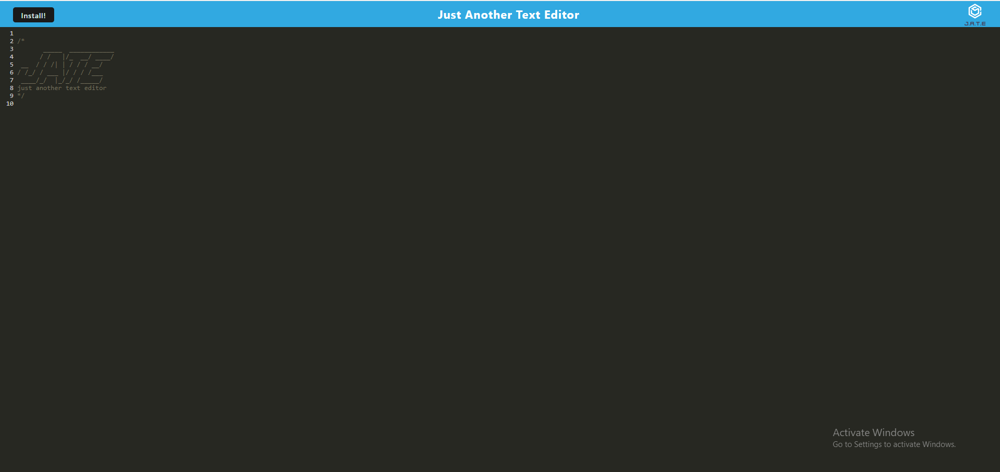

# pwa-text-editor
## Description 

This project is a text editor web application that offers reliable functionality, whether connected to the internet or not. The goal is to provide users with a seamless experience for creating, storing, and retrieving notes or code snippets, ensuring that their work is always accessible.

By designing a text editor that functions offline, users can reliably access and create notes or code snippets regardless of their internet connection status. The project organizes content in a client-server folder structure, making it easier to manage and maintain the application's components. The use of Webpack to bundle JavaScript files ensures efficient asset management and generation of HTML files, service workers, and manifest files.

## Heroku URL

[PWA Text Editor](https://pwa-text-editor-f62359adbc99.herokuapp.com/)

## Installation

Installed the program using npm i. Must also make sure that if-env and express modules are installed. 

Run npm run build and npm run dev to open the program.

## Usage

The following image shows the web application's appearance and functionality:

## Credits

N/A

## License

N/A

